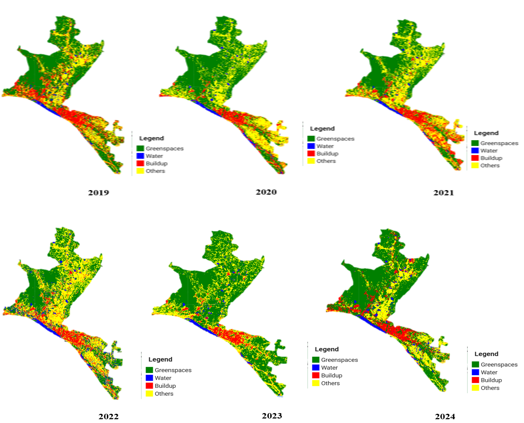
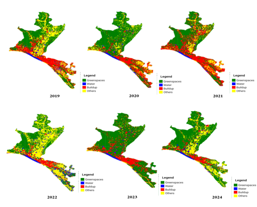
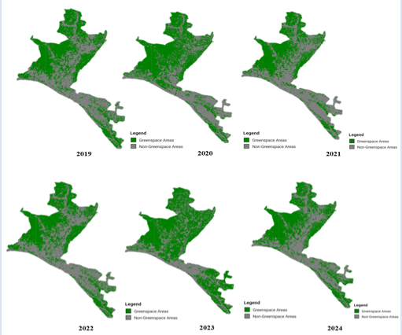
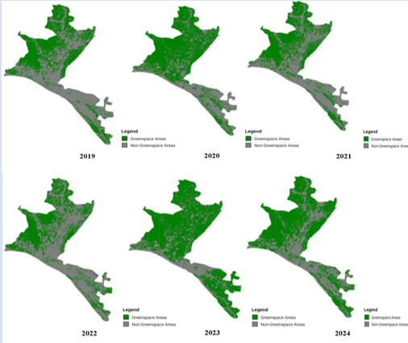

# 🌿 Greenspace Change Detection in Vijayawada (2019–2024)

> A remote sensing + machine learning project using **Google Earth Engine (GEE)** to monitor greenspace dynamics in Vijayawada city over six years.  
> Implemented using **Sentinel-2 imagery**, and classified via **Random Forest (RF)** and **Support Vector Machine (SVM)** algorithms.

---

## 📌 Project Highlights

- 📍 **Study Area:** Vijayawada, Andhra Pradesh, India  
- 🛰️ **Imagery:** Sentinel-2 (cloud-free composites)  
- 🧠 **Models Used:** Random Forest (RF) & Support Vector Machine (SVM)  
- 🗂️ **Outputs:** Year-wise LULC & greenspace maps + area statistics  
- 🧪 **Tools:** GEE, shapefiles, charts, visualizations

---

## 🛠️ Methodology

1. 🗺️ AOI defined using shapefiles  
2. 🛰️ Filtered Sentinel-2 SR imagery (Jan–Dec each year)  
3. 🎯 Trained RF & SVM with labeled land cover classes  
4. 🧼 Post-classification: accuracy assessment + charting  
5. 🌱 Extracted greenspace mask + yearly summaries

---

## 📁 Project Structure

```
epics_project/
├── Main-Scripts/              → Year-wise GEE JavaScript files
├── VIJAYAWADA_BOUNDARY/       → AOI shapefile (.shp, .shx, etc.)
├── Outputs/                   → Final LULC & greenspace visuals
└── README.md
```

---

## 🖼️ Key Visual Outputs

### 🗺️ Yearly LULC Maps (2019–2024) — Random Forest

<p align="center">
  
</p>

---

### 🧠 Yearly LULC Maps (2019–2024) — SVM

<p align="center">
  
</p>

---

### 🌿 Greenspace Classification — RF Model

<p align="center">
  
</p>

---

### 🌿 Greenspace Classification — SVM Model

<p align="center">
  
</p>

---

## 📊 Greenspace Area Summary

| 📅 Year | 🌱 RF Area (sq.km) | 🌱 SVM Area (sq.km) |
|--------|--------------------|---------------------|
| 2019   | 541.41             | 479.63              |
| 2020   | 575.25             | 645.75              |
| 2021   | 494.29             | 496.39              |
| 2022   | 451.76             | 430.99              |
| 2023   | 681.08             | 744.22              |
| 2024   | 552.07             | 624.63              |

---

## 📍 AOI: Vijayawada Boundary

- Defined using uploaded shapefile assets
- Used for clipping, training, and analysis  
- 📂 See folder: `VIJAYAWADA_BOUNDARY/`

---


## 🛠️ Tools & Technologies

| 🧩 Component      | 💡 Tool Used               |
|------------------|----------------------------|
| Data Source      | Sentinel-2 (via GEE)       |
| Platform         | Google Earth Engine (GEE)  |
| Algorithms       | Random Forest, SVM         |
| Visuals          | GEE Charts, PPT, PNG       |
| AOI Boundary     | Custom shapefile (VJA)     |

---

## 👩‍💻 Contributors

- 👩‍💻 **Abhinaya Chalamalasetti**
- 👩‍💻 **Vemuri Nikshipta**
- 👩‍💻 **Rajulapati Nandini**
---

